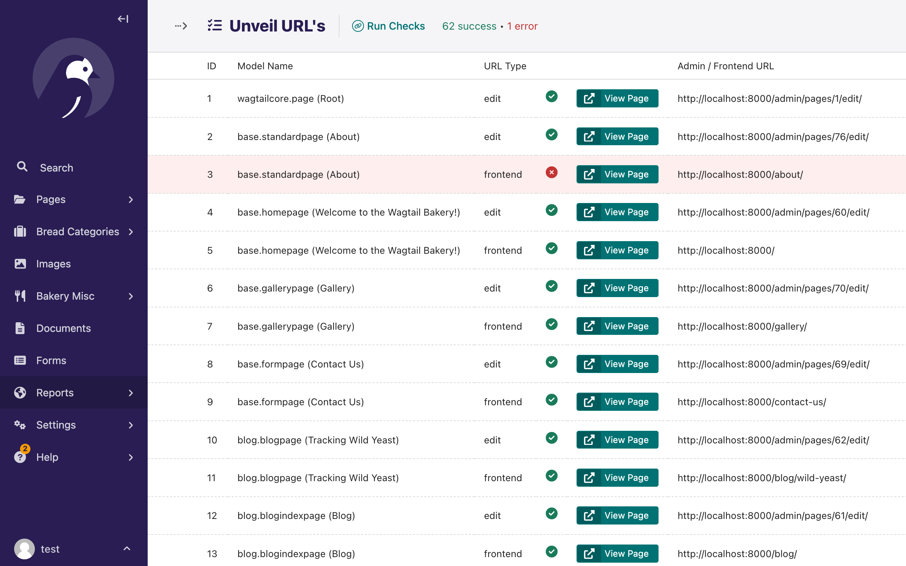

# Wagtail Unveil

A Wagtail package that helps map and expose admin and frontend URLs in your Wagtail project.

## Features

### URL Discovery

Automatically discovers and lists all available Wagtail admin and frontend URLs in your project.

### JSON API Endpoint

Access all your project URLs via a JSON API endpoint, therefore your can use external tools to consume the data.

  - Configurable parameters: `max_instances`, `base_url`, `group_by`
  - Grouping options: Group URLs by interface (backend/frontend) or by URL type
  - Comprehensive coverage: Pages, snippets, ModelAdmin, ModelViewSet, settings, images, and documents
  - Detailed metadata with counts for different URL types and categories

### Command Line Interface

Use the management command to quickly list and export URLs iwth configurable output to  control the level of detail and output format.

### Report View

View your project's URLs in a user-friendly Wagtail admin interface with interactive URL validation: Check if URLs are accessible with visual success/error indicators
  


## Features

### URL Discovery

Automatically discovers and lists all available Wagtail admin and frontend URLs in your project.

### JSON API Endpoint

Access all your project URLs via a JSON API endpoint, therefore your can use external tools to consume the data.

  - Configurable parameters: `max_instances`, `base_url`, `group_by`
  - Grouping options: Group URLs by interface (backend/frontend) or by URL type
  - Comprehensive coverage: Pages, snippets, ModelAdmin, ModelViewSet, settings, images, and documents
  - Detailed metadata with counts for different URL types and categories

### Command Line Interface

Use the management command to quickly list and export URLs iwth configurable output to  control the level of detail and output format.

### Report View

View your project's URLs in a user-friendly Wagtail admin interface with interactive URL validation: Check if URLs are accessible with visual success/error indicators
  


## Install the package into your Wagtail project

Suggested install method is via pip but you should use the method that best fits your project setup:

```bash
pip install wagtail-unveil
```

**Note**: The package is not yet available on PyPI, so you may need to install it directly from this GitHub repository.

Update your wagtail settings to include `wagtail_unveil`:

```python
INSTALLED_APPS = [
    # ...
    "wagtail_unveil",
    # ...
]
```

## Enabling the API

To enable the JSON API endpoint, add the following to your project's main urls.py file:

```python
from django.urls import include, path

urlpatterns = [
    # ... your existing URL patterns
    path("unveil/", include("wagtail_unveil.urls")),
    # ...
]
```

Once configured, you can access the API at:
```
http://your-domain.com/unveil/urls/
```

The API accepts the following optional query parameters:
- `max_instances`: Maximum number of instances to show per model (default: 1)
- `base_url`: The base URL to use for generated URLs (default: http://localhost:8000)
- `group_by`: How to group the URLs. Options are `interface` (backend/frontend) or `type`

Example API request:
```
http://your-domain.com/unveil/urls/?max_instances=2&group_by=interface
```

## Usage

### Command Line

Wagtail Unveil provides a management command to list all admin URLs:

```bash
python manage.py list_admin_urls
```

The command has a few flags that can be used to adjust the output. The flags are all optional:

- `--base_url`: The base URL to use for the output. Auto generated from the Wagtail site settings.
- `--output`: Output the urls to the console or to a file. Default is console.
- `--file`: The file name to output the urls to. This is only used if the output option is set to file the file type is a simple text file.
- `--max-instances`: The maximum number of instances to show for each URL. This is used to adjust the number of instances shown in the output. The default is 1 a value of 0 will show all instances.

## Upcoming Features

I'm maintaining a list of features that I plan to add in the future or i'm currently working on [here](https://github.com/wagtail-packages/wagtail-unveil/issues). If you have any suggestions or requests, please feel free to open an issue.

## Contributing

Contributions are welcome! Please feel free to submit a Pull Request.

## License

This project is licensed under the terms of the MIT license.
